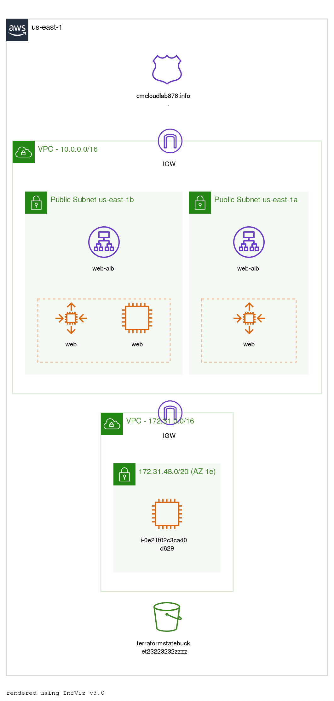

# Cloud Deployment and Hosting

This is a sample static website running HTML5 hosted in AWS to demstrate IaC, the code deploys:
+ 1 VPC  (10.0.0.0/16)
+ 2 Public subents
+ 1 Internet gateway with route table updates
+ 2 Security groups
+ 1 Application load balancer
+ 1 Target group
+ 1 Auto-scaling group
+ 1 Launch Configuration
+ Initally 2 EC2 web instances running Apache running a sample static page from https://github.com/p-batey/static-website.git
+ CloudWatch alarms for autoscaling

## Running the website

The demo website requries an AWS account with a public hosted zone

## Prerequisites

The following steps must be ran to setup the terraform deployment node, once complete the terraform is used to deploy the required infrastructre and site.
+ Create a new key-pair (automation) to allow access to the terraform node from your local machine
+ Create a new IAM Policy (automationPolicy) as outlined in supp/automationPolicy.json
+ Create a new IAM Role for EC2 (automationRole) using automationPolicy
+ Create a new EC2 instance (automationEC2)
    - Use the region us-east-1 - US East (N. Virginia)
    - use a t2.mirco Amazon Linux 2 AMI in the default VPC & subnet
    - Assign the Role automationEC2
    - Add the following user data commands:  
        #! /bin/bash 
        yum update -y 
        wget https://releases.hashicorp.com/terraform/0.14.5/terraform_0.14.5_linux_amd64.zip 
        unzip terraform_0.14.5_linux_amd64.zip 
        mv terraform /usr/local/bin 
        yum -y install python3-pip git 
        pip3 install awscli --user 
        
    - Use the current security-group (rename: automation-sg) allowing only SSH (TPC/22) from the public IP of your current host/connection
    - Build with the automation key-pair (created & downloaded in the first step)
+ Connect to the EC2 instance using the automation private key
+ git clone https://github.com/p-batey/project3.git
+ cd project3
+ ssh-keygen -t rsa -f /home/ec2-user/.ssh/id_rsa -q -P "" 
+ curl http://169.254.169.254/latest/meta-data/public-ipv4      # Determine public IP of current instance
+ aws s3api create-bucket --bucket terraformstatebucket23223232 --region us-east-1 # needs to be unique in AWS
+ edit backend.tf 
    - set the variable bucket as per the bucket created above
+ edit variables.tf
    - set the automation_pub_ip variable to the output from the curl command
+ terraform init
+ terraform validate
+ terraform plan    # Expect 19 resources
+ terraform apply   # Takes around 2 minutes to complete the deployment

Once the deployment is complete, you can access the demo site in a browser at [https://web-demo.<aws_public_hosted_zone>], the correct URL will be provided as output from the terraform deployment

## Testing
2 EC2 instances will initally be launched with CloudWatch used to monitor the average CPU, if this goes over 60% for 5 minutes further instances will be created upto a maximum of 4
+ ssh to one of the web instances from the terrform node using the exsiting private key under /home/ec2-user/.ssh/id_rsa private key
+ sudo amazon-linux-extras install epel -y
+ sudo yum install stress -y
+ sudo stress --cpu 2 --timeout 600

This will cause the auto-scaling group of start another instance using the Launch Configuration
